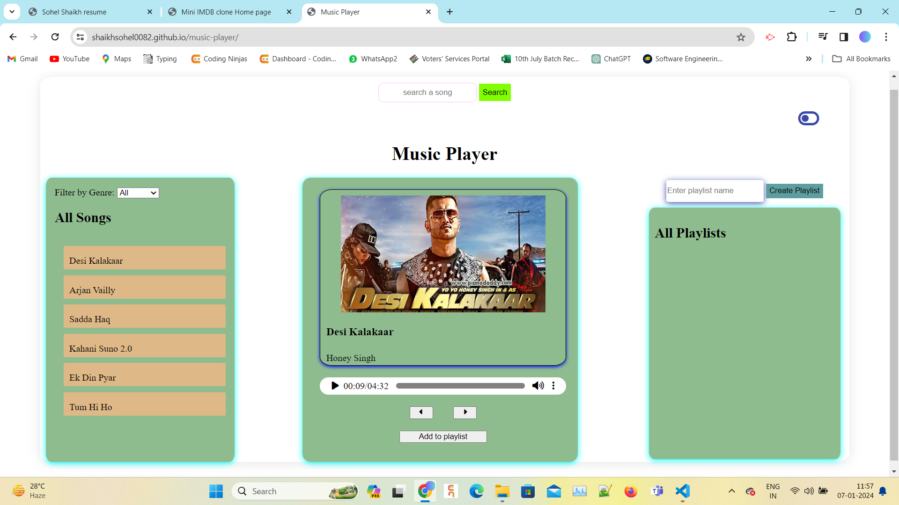

# Music Player Web Application

This is a simple web application for playing and managing music playlists. Users can search for songs, create playlists, and enjoy their favorite music. The application supports both light and dark modes for user customization.

## Table of Contents
- [Features](#features)
- [Screenshots](#screenshots)
- [Usage](#usage)
- [Technologies Used](#technologies-used)
- [Hosting Link](#hosting-link)

## Features

- Search for songs
- Switch between light and dark modes
- Create and manage playlists
- Play, pause, skip, and control volume of songs
- Responsive design for various screen sizes

## Screenshots

## Usage
- Use the search bar to find songs.
- Click on a song to start playing it.
- Switch between light and dark modes using the theme toggle button.
- Create playlists and add songs to them.

## Technologies Used
- HTML5
- CSS3
- JavaScript
- External Libraries: Font Awesome for icons

 
## Hosting link:
[Music Player](https://shaikhsohel0082.github.io/music-player/)
